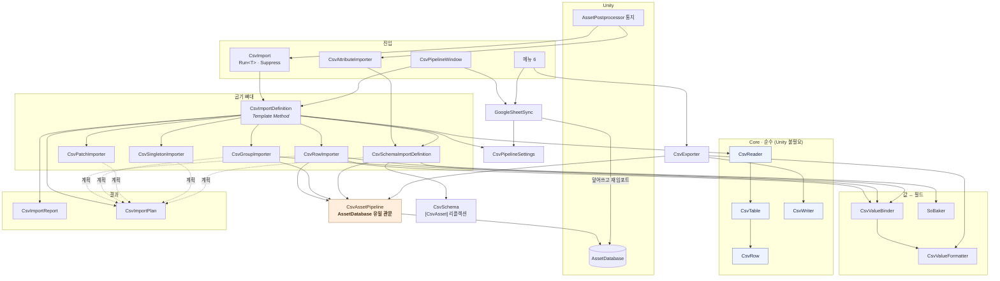

# 심층 기술 분석 및 로드맵 — CSV Pipeline

분석일 2026-08-10 · 대상 `com.toflaks.csv-pipeline` v0.7.0

> **두 가지 전제를 먼저 밝힙니다.**
>
> ① 대상은 게임이 아니라 **에디터 전용 도구 패키지**입니다. 요청서의 "게임 루프"는
> **임포트 루프**(표 저장 → 통지 → 굽기 → 보고)로 읽었고, Object Pooling·DOTS처럼
> 런타임 전제의 항목은 이 도구에서 실제로 병목인 것으로 갈아 끼웠습니다. 억지로 맞추지 않았습니다.
>
> ② **이 코드는 제가 작성했습니다.** 자기검토는 후하게 나오기 마련이라, 인상 대신 측정값을
> 근거로 씁니다. 아래 수치는 전부 이번에 실제로 세어 본 것입니다.

---

## 0. 측정한 현재 상태

| 항목 | 값 |
|---|---|
| 코드 | **29파일 / 5,858줄** (Editor) |
| 검사 | 8파일 / 1,250줄, **72건 전부 통과**(배치 실행) |
| 공개 타입 | 37 |
| **인터페이스** | **0** |
| 메서드 | 171개, 그중 **40줄 초과 15개** |
| 가변 정적 | 8 |
| Unity 비의존 파일 | 6 (완전 순수) + 3 (UnityEngine만) |
| 최대 파일 | `GoogleSheetSync.cs` **737줄** |
| 최대 팬아웃 | `CsvPipelineWindow` · `CsvSchemaImportDefinition` **각 16타입** |

---

## 1. 코드 아키텍처 및 품질

### 1-1. 핵심 역할 요약

계층이 실제로 갈려 있습니다. 아래는 위에서 아래로 의존합니다.

**Core — 순수 파싱 (Unity 없이 돌아감)**

| 파일 | 핵심 역할 |
|---|---|
| `CsvReader` | 구분자 텍스트를 RFC 4180 규칙으로 해석해 헤더·행·줄번호를 갖춘 표로 만든다. |
| `CsvRow` | 한 행의 셀을 타입·리스트·대소문자 무시로 읽어 주는 값 접근자. |
| `CsvTable` | 헤더를 함께 들고 있어 "그 열이 표에 있는가"를 답한다. |
| `CsvWriter` | 셀을 규칙대로 감싸 표 텍스트로 되돌린다. |

**Baking — 값 ↔ 필드**

| 파일 | 핵심 역할 |
|---|---|
| `CsvValueBinder` | 셀 원문을 `SerializedProperty`에 써 넣는다. (리스트·열거형·참조 포함) |
| `CsvValueFormatter` | 그 반대 방향. 필드 값을 셀 문자열로 되돌린다. |
| `SoBaker` | 빈 셀이면 기존 값을 보존하는 필드 세터 모음. |
| `AssetNameIndex<T>` | 이름으로 다른 에셋을 찾는 색인. |

**Importing — 굽기의 뼈대**

| 파일 | 핵심 역할 |
|---|---|
| `CsvImportDefinition` | 파일 감지·파싱·열 검증·진행/취소·보고·저장이라는 **불변 절차**를 담고 굽기만 파생에 맡긴다. |
| `CsvRowImporter` / `CsvGroupImporter` / `CsvPatchImporter` / `CsvSingletonImporter` | 표의 네 가지 모양별 굽기 규칙. |
| `CsvImport` | `AssetPostprocessor`의 정적 콜백에서 정의를 실행하고, 자동 임포트를 멈추는 범위를 연다. |
| `CsvAssetPipeline` | **AssetDatabase에 닿는 유일한 관문.** 폴더 보장·생성/로드·정리·참조 조사. |

**Schema — 코드 없는 길**

| 파일 | 핵심 역할 |
|---|---|
| `CsvAttributes` | `[CsvAsset]`·`[CsvColumn]`·`[CsvIgnore]` 선언. |
| `CsvSchema` | 타입을 리플렉션해 열↔필드 연결 계획을 만든다. |
| `CsvSchemaImportDefinition` | 그 계획을 실행한다. 유일하게 **필드 단위 diff**까지 낸다. |

**나머지**

| 파일 | 핵심 역할 |
|---|---|
| `CsvImportReport` / `CsvImportPlan` | 결과와 계획. 흩어진 로그를 한 줄로 모으고, 굽기 전에 무엇이 달라지는지 담는다. |
| `CsvExporter` | 에셋을 다시 표로 뽑는다. 원본 헤더 표기를 지킨다. |
| `GoogleSheetSync` | 구글 시트에서 표를 받고 비교한다. |
| `GoogleServiceAccount` | 서비스 계정 키로 액세스 토큰을 받는다. |
| `CsvPipelineWindow` | 표·시트·설정을 한 화면에서 다룬다. |
| `CsvPipelineSettings` | 프로젝트마다 달라지는 폴더 위치. |

### 1-2. 디자인 패턴 진단

**쓰이고 있는 것**

| 패턴 | 어디 | 적절한가 |
|---|---|---|
| **Template Method** | `CsvImportDefinition.Execute/Run` → `Process` 훅 | **적절.** 절차의 불변 부분(열 검증·취소·보고·저장)을 한 곳에 묶는 데 정확히 맞는 도구입니다. |
| **Scope Guard (RAII)** | `CsvImport.Suppress()` `IDisposable` | **적절.** 예외로 빠져나가도 되살아납니다. |
| **Ambient Singleton + Null Object** | `CsvPipelineSettings.Instance` | **적절한 변형.** 없으면 임시 인스턴스를 돌려주어 null 검사를 없애고, 소비 프로젝트에 에셋을 말없이 만들지 않습니다. |
| **Observer** | `CsvRebuildMenu.AfterRebuildAll` | **적절.** 패키지가 소비자의 타입을 몰라도 되게 합니다. |
| **Value Object** | `CsvRow`(readonly struct) · `CsvTable` | 적절. |
| **선언적 매핑 (Attribute-driven)** | `[CsvAsset]` + `CsvSchema` | 적절. 코드 없는 길의 핵심입니다. |

**가장 도입이 시급한 것 — 경계(Seam)를 위한 인터페이스**

**인터페이스가 0개입니다.** 확장점이 전부 추상 클래스이고, AssetDatabase에 닿는 길은 `CsvAssetPipeline`이라는 **정적 클래스** 하나입니다. 결과가 둘입니다.

1. **`CsvAssetPipeline` 위의 모든 것이 살아 있는 Unity 프로젝트를 요구합니다.** 그래서 왕복 검사가 단위 검사가 아니라 임시 폴더를 만드는 통합 검사가 됐고, 실제로 **검사끼리 경로가 얽혀 실행 순서에 따라 결과가 달라지는 사고**를 겪었습니다.
2. 단일 상속이라 굽기 규칙을 **조합할 수 없습니다.** "행마다 굽되 일부는 패치" 같은 표는 베이스를 골라 쓸 수 없어 처음부터 다시 씁니다.

제안: `IAssetGateway`(생성·로드·삭제·참조조사)를 뽑아 `CsvAssetPipeline`을 그 기본 구현으로 두는 것. 검사에서 인메모리 구현을 끼우면 왕복 검사 대부분이 **밀리초 단위 단위 검사**가 되고, 위 ①의 얽힘이 원천적으로 사라집니다.

### 1-3. 코드 스멜

**① `GoogleSheetSync` — 737줄, 책임 9개 (가장 심각)**

한 정적 클래스가 이걸 다 합니다. 메뉴 명령 · 자동 받기 스케줄러 · HTTP 다운로드 · HTML 응답 판별 · 표 차이 진단 · 스냅숏 관리 · 파일 쓰기 · 재임포트 발화 · 설정 에셋 탐색.

- `CompareAllAsync` (`GoogleSheetSync.cs:296`) — **88줄, 코드베이스 최장.** 진행바·다운로드·검증·비교·보고를 한 메서드에서 합니다.
- `PullOneAsync` (`:513`) — **81줄.** 존재 확인 → 다운로드 → HTML 검사 → 헤더 확인 → 스냅숏 대조 → 기록까지 직선으로 이어집니다.
- 진단 로직(`DescribeDifference` `:393`, `IndexByFirstField` `:458`, `FirstField` `:481`)은 **네트워크와 아무 상관이 없는 순수 텍스트 비교**인데 이 파일에 갇혀 있어 검사할 수 없습니다.

**② `CsvPipelineWindow` — 557줄, 팬아웃 16**

갈래 셋(표·시트·설정)이 한 클래스에 있습니다. 지금은 읽히지만 갈래가 하나만 더 늘어도 무너집니다. 각 갈래를 별도 그리기 클래스로 빼면 창은 갈래 전환만 하게 됩니다.

**③ 다섯 곳에 흩어진 같은 골격**

`CsvRowImporter` · `CsvGroupImporter` · `CsvPatchImporter` · `CsvSingletonImporter` · `CsvSchemaImportDefinition`의 `Process`가 전부 같은 뼈대를 되풀이합니다 — 인덱스 루프 → `ReportRowProgress` → 취소 확인 → `CountCreated/Updated` → (해당하면) 정리.

**측정**: 다섯 파일 모두 `ReportRowProgress` 1회, 정리하는 셋은 `IsCancelled` 1회씩. **이 되풀이가 위험한 이유**는, 취소 시 정리를 건너뛰는 규칙을 다섯 군데에 각각 적어야 하기 때문입니다. 한 곳만 빠뜨리면 **취소가 에셋을 지우는 버튼이 됩니다.**

**④ 하드코딩된 구글 주소가 두 파일에 흩어짐**

`GoogleSheetSyncSettings.cs:72`(export URL)와 `GoogleSheetSyncSettingsEditor.cs:115`(edit URL)가 각자 주소를 조립합니다. 구글이 형식을 바꾸면 한쪽만 고치고 넘어가기 쉽습니다.

**⑤ 두 개의 파서 진입점**

`CsvReader.Read`(대소문자 **구분**, boxed 숫자)와 `ReadTable`(대소문자 **무시**)이 공존합니다. 호환을 위해 일부러 남긴 것이지만, **고르는 쪽에 따라 동작이 다른 API 두 벌**은 그 자체로 함정입니다. 실제로 자동 연결이 통째로 무동작이던 결함의 뿌리가 이 대소문자 규칙이었습니다.

**⑥ 작은 순환**

`CsvImportDefinition.Execute` → `CsvImport.IsSuppressed`, `CsvImport.Run<T>` → `CsvImportDefinition`. 상호 참조입니다. 크지 않지만 억제 상태를 별도 타입으로 빼면 없앨 수 있습니다.

---

## 2. 알고리즘 연결성 및 시각화

### 2-1. 아키텍처 다이어그램



### 2-2. 로직 흐름 — 표 하나가 에셋이 되기까지

```
① 사람이 표를 저장한다
      ↓
② Unity → OnPostprocessAllAssets(imported, deleted, moved)
      ↓
③ CsvImport.Run<T>  또는  CsvAttributeImporter(모든 [CsvAsset] 순회)
      ↓
④ CsvImportDefinition.Execute
      ├ CsvImport.IsSuppressed 면 즉시 반환        ← 대량 쓰기 중 되굽기 방지
      ├ deleted 에 내 파일이 있으면 경고만          ← 산출물은 절대 안 지움
      └ Touched 아니면 반환                        ← 남의 표에는 반응 안 함
      ↓
⑤ CsvImportUtil.ReadTable → CsvReader.ReadTable
      TextAsset 실패 시 디스크 직접 읽기            ← .tsv 는 TextAsset 이 아님
      ↓
⑥ 필수 열 검증 — 빠지면 여기서 멈춤               ← 빈 셀로 굽는 것보다 멈추는 게 낫다
      ↓
⑦ Process(table, report)  ← 파생 클래스
      행마다: ReportRowProgress(취소 확인)
             → CsvAssetPipeline.CreateOrLoad
             → Bake / SoBaker / CsvValueBinder
             → ApplyModifiedPropertiesWithoutUndo → SetDirty
             → FlushIfCreated                     ← 생성 직후엔 저장을 미루지 않음
      ↓
⑧ 정리 — 취소됐으면 건너뜀                        ← 안 읽은 행의 에셋을 지우면 안 됨
      CsvAssetPipeline.Reconcile* → 참조 조사 → 참조 남으면 보존
      ↓
⑨ CsvImportReport.Emit — 표당 로그 한 줄
      ↓
⑩ report.Touched 면 AssetDatabase.SaveAssets
```

**미리보기(`Plan`)는 ⑦~⑧을 그대로 밟되 아무것도 쓰지 않습니다.** 스키마 경로는 원본의 **사본을 만들어 실제 변환기로 구워 본 뒤** 값을 비교합니다. 흉내 내지 않는 것이 핵심입니다 — 흉내 내면 미리보기와 실제가 갈라지고, 그건 미리보기가 없느니만 못합니다.

### 2-3. 결합도 진단

**팬아웃 (이 타입이 몇 개를 아는가)**

| 타입 | 팬아웃 | 진단 |
|---|---|---|
| `CsvPipelineWindow` | 16 | **높지만 정상.** 창은 원래 다 알아야 합니다. 다만 갈래별로 쪼개면 각 20% 수준으로 내려갑니다. |
| `CsvSchemaImportDefinition` | 16 | **높고 문제.** 굽기·계획·diff·리플렉션을 한 클래스가 다 합니다. |
| `CsvExporter` | 11 | 보통. |
| `GoogleSheetSync` | 5 | 낮음. **팬아웃은 낮은데 줄 수가 737** — 즉 남을 안 부르고 혼자 다 합니다. 전형적인 God Class 신호입니다. |

**팬인 (몇 개 파일이 이 타입을 아는가) — 바꾸면 파장이 큰 곳**

| 타입 | 팬인 |
|---|---|
| `CsvAssetPipeline` | **10** |
| `CsvTable` | 9 |
| `CsvPipelineSettings` | 8 |
| `CsvImportReport` · `CsvImportPlan` | 각 7 |

**`CsvAssetPipeline`이 팬인 1위라는 사실이 1순위 리팩토링의 근거입니다.** 가장 많이 의존받는
타입이 정적 클래스이고 AssetDatabase에 직결돼 있습니다. 경계를 넣을 곳이 여기라고 수치가 말합니다.

**진단: 위험한 강결합은 하나뿐입니다.**

**`CsvAssetPipeline` ↔ AssetDatabase.** 정적 클래스라 대체할 수 없고, 그 위의 모든 것이 살아 있는 Unity 프로젝트를 요구합니다. 나머지 결합은 계층 방향(위→아래)이고 순수 계층이 실제로 분리돼 있어 — **6개 파일은 Unity 없이 컴파일·실행됩니다** — 건강한 편입니다.

한 가지 더: **`CsvImportDefinition`의 취소 규칙이 파생 다섯 곳에 흩어져 있는 것**은 결합이 아니라 **계약의 분산**입니다. 컴파일러가 강제하지 않으므로, 새 베이스를 추가하는 사람이 정리 건너뛰기를 빠뜨려도 아무도 막지 못합니다.

---

## 3. 향후 기능 제언

### 3-1. 기술적 확장 — 구조를 안 건드리고 되는 것

| 제안 | 왜 지금 쉬운가 |
|---|---|
| **CI 드리프트 검사** | `Plan()`이 이미 "표와 에셋이 어긋나는가"를 계산합니다. 정적 진입점 하나 + `-executeMethod`면 **배치 모드에서 종료코드로 답하는 검사**가 됩니다. 표를 고치고 굽는 걸 잊은 커밋을 CI가 잡습니다. **노력 최소, 효과 최대.** |
| **SCPPJ 임포터를 `[CsvAsset]`으로 전환** | 15개 중 5개가 속성만으로 표현됩니다. 코드 300여 줄이 선언 몇 줄로 줄고, 그 표들이 **필드 단위 미리보기와 역방향 내보내기**를 공짜로 얻습니다. |
| **표 → 스크립트 역생성** | 이전에 논의하고 접었던 안입니다. 다시 볼 만해진 이유는 **미리보기가 생겼기 때문**입니다. 추론 결과를 적용 전에 검토·수정하는 화면이 이제 있으므로, 추론의 부정확성(측정: 25열 중 16열 오추론)이 치명적이지 않게 됩니다. |
| **TSV 내보내기** | 읽기는 되는데 쓰기는 구분자가 `CsvWriter`에 이미 있습니다. 몇 줄입니다. |

### 3-2. 사용자 경험 제언

- **양쪽이 함께 바뀐 경우의 충돌 경고.** 지금은 시트가 이기고 로컬 수정은 "흔적이 있다"고만 알립니다. 스냅숏이 있으므로 **3자 비교**(스냅숏 · 로컬 · 시트)가 가능하고, 그러면 "둘 다 바뀌었다"를 정확히 말할 수 있습니다. 데이터 손실이 실제로 나는 유일한 자리입니다.
- **열 소유권 표시.** 어떤 열이 표 소유이고 어떤 필드가 인스펙터 소유인지 인스펙터에서 보이면, 표로 덮이는 값을 손으로 고치다 날리는 일이 줄어듭니다. `[CsvColumn]` 정보로 커스텀 인스펙터를 그리면 됩니다.
- **문제만 모아 보는 갈래.** 지금은 표별로 흩어져 있습니다. 표 20장 규모에서는 "문제 있는 것만" 목록이 필요해집니다.

### 3-3. 최적화 — 측정된 병목

요청서의 Object Pooling·DOTS는 런타임 전제라 이 도구엔 해당이 없습니다. 실제 병목은 셋입니다.

**① `CsvAssetPipeline.FindReferenced` — 진짜 병목 (O(프로젝트 크기))**

행이 하나라도 사라지면, **프로젝트의 모든 `.unity`·`.prefab`·`.asset` 파일을 열어 텍스트로 읽습니다.** SCPPJ 정도에서도 수천 파일이고, 표 하나 저장할 때마다 일어날 수 있습니다.

> 해결: **GUID 역인덱스를 한 번 만들어 캐시**하고 에셋 변경 통지로 무효화. 또는 `AssetDatabase.GetDependencies`를 역방향으로 쓰기. 최소한 **한 임포트 배치 안에서는 결과를 재사용**해야 합니다. 지금은 표마다 다시 훑습니다.

**② 어셈블리 전수 스캔이 두 곳**

`CsvSchema.All()`과 `CsvImportDefinition.DiscoverAll()`이 로드된 모든 어셈블리의 모든 타입을 훑습니다. `All()`은 캐시가 있지만 `DiscoverAll()`은 **부를 때마다 다시** 합니다. 창을 새로고침할 때마다 비용을 냅니다.

**③ `FindCsvPath`의 반복 호출**

`ResolveOutputFolder()`가 이걸 부르는데, 스키마 경로에서 세 군데(`CsvSchemaImporter.cs:19`·`:28`·`:124`)가 각자 부릅니다. **굽기 한 번에 2회, 계획 한 번에 2회 — 매번 프로젝트 전역 검색입니다.** 정의 인스턴스가 한 번의 실행 동안만 살아 있으므로 인스턴스 캐시 한 줄로 끝납니다.

**아키텍처 차원**: 이벤트 주도로 갈 필요는 없습니다. `AssetPostprocessor`가 이미 그 역할이고, `AfterRebuildAll`로 확장점도 있습니다. **지금 필요한 건 새 아키텍처가 아니라 위 세 곳의 캐시입니다.**

---

## 4. 리팩토링 로드맵

### 1순위 — AssetDatabase 경계를 만든다

`IAssetGateway`를 뽑고 `CsvAssetPipeline`을 기본 구현으로. 검사에는 인메모리 구현을 끼웁니다.

**얻는 것**: 왕복 검사가 통합 검사에서 **단위 검사**가 됩니다. 실행이 분에서 밀리초로 줄고, **임시 폴더가 필요 없어져 검사끼리 얽히는 사고가 원천적으로 사라집니다.** 이미 그 사고를 한 번 겪었고, 원인을 찾는 데 여러 차례의 배치 실행이 들었습니다. 덤으로 "패키지가 Unity에 얼마나 매여 있는가"가 코드로 드러납니다.

### 2순위 — `GoogleSheetSync` 737줄을 넷으로 가른다

`SheetDownloader`(HTTP·인증) · `SheetDiff`(순수 텍스트 비교) · `SheetSnapshot`(스냅숏 읽기/쓰기) · `SheetSyncScheduler`(자동 받기).

**얻는 것**: `DescribeDifference`·`IndexByFirstField`·`FirstField`는 네트워크와 무관한 **순수 함수인데 지금은 검사할 수 없습니다.** 갈라내면 검사 대상이 되고, 88줄·81줄짜리 메서드가 사라집니다. 시트 연동은 데이터 손실이 실제로 날 수 있는 유일한 경로라 검사 가치가 가장 높은 자리이기도 합니다.

### 3순위 — 굽기 골격을 상위로 끌어올린다

파생 다섯 곳에 흩어진 루프·진행·취소·집계·정리를 `CsvImportDefinition`의 템플릿으로 올리고, 파생은 "행 하나를 어떻게 굽는가"만 남깁니다.

**얻는 것**: **취소 시 정리를 건너뛰는 규칙이 한 곳에서 강제됩니다.** 지금은 새 베이스를 추가하는 사람이 그 줄을 빠뜨리면 취소가 에셋을 지우는 버튼이 되는데, 컴파일러도 검사도 막지 못합니다. 중복 제거는 부수 효과이고, **안전 규칙을 계약으로 만드는 것**이 본론입니다.

---

### 순위에 들지 않은 것과 그 이유

- **인터페이스 전면 도입** — 1순위가 필요한 경계를 이미 만듭니다. 그 밖의 추상 클래스는 단일 상속이 실제로 걸림돌이 된 사례가 아직 없어, 지금 뽑으면 쓰지 않는 추상화가 됩니다.
- **`CsvReader.Read` 제거** — 두 진입점은 분명한 부채지만, SCPPJ의 임포터 4종이 아직 씁니다. **3-1의 `[CsvAsset]` 전환이 끝난 뒤** 제거하는 것이 순서입니다.
- **`FindReferenced` 캐시** — 병목은 확실하나 **아직 실측하지 않았습니다.** 이 프로젝트에서 표 저장이 체감상 느리지 않다면 3순위 뒤로 미뤄도 됩니다. 고치기 전에 재는 것이 순서입니다.
